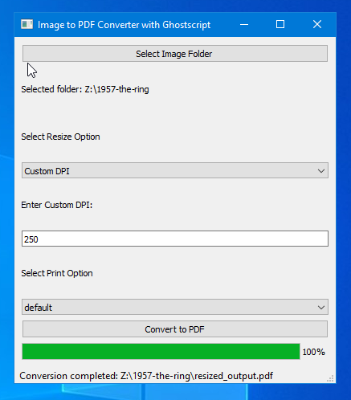

# TIFF-to-PDF-Generator
A windows application to convert multiple TIFF images to PDF with options to control PDF size and quality. This tool uses [img2pdf](https://github.com/myollie/img2pdf) and [Ghostscript](https://ghostscript.readthedocs.io/en/latest/#) for the generation and conversion.

# Installation and Usage

Detailed documentation is given in tutorial [ [Markdown](docs/TIF_pdf_documentation.md) | [PDF](docs/TIF_pdf_documentation.pdf) ] page.

# Steps to build from Source

1. Install Python 3.12.0
2. Install libraries from Requirements.txt
3. Use pyinstaller to buld the source code to executable.
4. Install [Inno Setup](https://jrsoftware.org/isinfo.php) and use `inno_script.iss` to build the final executable with ghost script.

