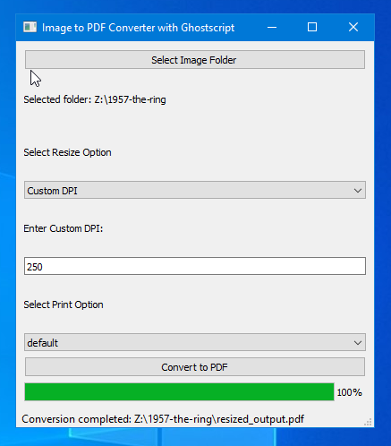

# TIFF PDF Converter Documentation

## Install Setup

1. Run Installer

Click Install.

2. Install Ghostscript when new window appears.

3. Finish Ghostscript installation. Make sure “Generate cidfmap for
Windows CJK TrueType fonts” clicked.

  
  

4.Finish Installation and open TIFF PDF Generator.

## Usage

1. Select the folder in which TIFF files exist using **Select Image
Folder **option. (Sometimes the folder looks empty. TIFF files won’t be
shown.)

2. When the folder is chosen, the folder path appears in the UI and
also number of files in the folder will be listed there (as shown in
rectangle).

  
  
  
3. Select **Custom DPI **from **Select Resize
Option**.

   
 
  
4. Enter required DPI (prefered DPI is
250).

5. Choose proper Print Option (Use *default* for usual cases). For
higher quality, use *prepress*. For very low quality, use *ebook*.

  
   

6. Now click **Convert.**

The progressbar will show 50% when *img2pdf* run successfully. It will
show 100% when completed conversion and status bar will show
successfully converted message with file path.

You can see two outputs in the TIFF folder – output.pdf, which is a
combined pdf with large size and resized_output.pdf, which is resized to
specified DPI.  

   

# Troubleshooting

### Check Ghostscript installation

Open cmd (command prompt). Run **gswin64c.**

  
  
  
Output will show **GS\> ** along with version of Ghostscript.

If this command is not recognized, check ghostscipt installation path in
`C:\\Program Files\\gs\\gs10.0.40`.

If this folder is present and gswin64c is present inside bin folder in
above path, add path to environmental variable.

  
  
  
Steps:

Right click **This PC**. Open **Properties**. Window on right side will
show up.

Alternatively, open this from Settings/Control Panel \> System.

From there, open **Advanced System Settings** as shown in screenshot
above.

From **Advanced** Tab, choose **Environment Variables**. Now click on
**path** and click **Edit**.

  
   

Now click **New** and add path to
ghsotscript bin folder there (`C:\\Program Files\\gs\\gs10.0.40/bin`) and
click **OK**. The path will appear like below. Now check ghostscript
installation again from command prompt again. It will show the version
details.
